<div align="center">

```
███████╗████████╗██████╗  █████╗ ████████╗ █████╗ ███████╗ ██████╗ █████╗ ███╗   ██╗
██╔════╝╚══██╔══╝██╔══██╗██╔══██╗╚══██╔══╝██╔══██╗██╔════╝██╔════╝██╔══██╗████╗  ██║
███████╗   ██║   ██████╔╝███████║   ██║   ███████║███████╗██║     ███████║██╔██╗ ██║
╚════██║   ██║   ██╔══██╗██╔══██║   ██║   ██╔══██║╚════██║██║     ██╔══██║██║╚██╗██║
███████║   ██║   ██║  ██║██║  ██║   ██║   ██║  ██║███████║╚██████╗██║  ██║██║ ╚████║
╚══════╝   ╚═╝   ╚═╝  ╚═╝╚═╝  ╚═╝   ╚═╝   ╚═╝  ╚═╝╚══════╝ ╚═════╝╚═╝  ╚═╝╚═╝  ╚═══╝
```

### `// TEMPORAL ATTACK-SURFACE RECONSTRUCTION ENGINE //`
#### *Passive-first OSINT · Archive Forensics · Secret Discovery · Attack-Surface Cartography*

<br/>

[](#)
[](#)
[](#license)
[](#the-capability-catalog)
[](#the-47-phase-pipeline)
[](#interfaces)
[](#-legal--ethical-use)

<br/>

**[Overview](#-overview)** •
**[Architecture](#-system-architecture)** •
**[Capabilities](#the-capability-catalog)** •
**[Offense](#-offensive-capability-profile)** •
**[Defense](#-defensive--protective-behavior)** •
**[Pipeline](#the-47-phase-pipeline)** •
**[Install](#-installation)** •
**[Usage](#-usage)** •
**[Reports](#-report-artifacts)** •
**[Threat Model](#-threat-model)** •
**[Ethics](#-legal--ethical-use)** •
**[Roadmap](#-roadmap)**

</div>

<br/>

<div align="center">

### ░▒▓█ SIGNAL LOCK ACQUIRED █▓▒░

*StrataScan does not attack the present. It interrogates the past to predict the present's weaknesses.*

</div>

---

## 📖 Table of Contents

1. [Overview](#-overview)
2. [Why StrataScan Exists](#-why-stratascan-exists)
3. [System Architecture](#-system-architecture)
4. [Design Philosophy](#-design-philosophy)
5. [The Capability Catalog](#the-capability-catalog)
   - [5.1 Archive & Historical Intelligence](#51-archive--historical-intelligence)
   - [5.2 Network, DNS & Transport Security](#52-network-dns--transport-security)
   - [5.3 Subdomain & Surface Expansion](#53-subdomain--surface-expansion)
   - [5.4 Content, Document & Binary Forensics](#54-content-document--binary-forensics)
   - [5.5 Client-Side & Application Intelligence](#55-client-side--application-intelligence)
   - [5.6 Secret, Credential & Leak Detection](#56-secret-credential--leak-detection)
   - [5.7 Correlation, Diffing & Temporal Analytics](#57-correlation-diffing--temporal-analytics)
   - [5.8 Reporting & Evidence Management](#58-reporting--evidence-management)
6. [Offensive Capability Profile](#-offensive-capability-profile)
7. [Defensive & Protective Behavior](#-defensive--protective-behavior)
8. [The 47-Phase Pipeline](#the-47-phase-pipeline)
9. [Data Flow & Sequence Diagrams](#-data-flow--sequence-diagrams)
10. [Interfaces](#interfaces)
11. [Installation](#-installation)
12. [Usage](#-usage)
13. [Command Reference](#-command-reference)
14. [Report Artifacts](#-report-artifacts)
15. [Threat Model](#-threat-model)
16. [Operational Security Notes](#-operational-security-notes)
17. [Legal & Ethical Use](#-legal--ethical-use)
18. [Comparison to Adjacent Tooling](#-comparison-to-adjacent-tooling)
19. [Roadmap](#-roadmap)
20. [Contributing](#-contributing)
21. [FAQ](#-faq)
22. [License](#license)

---

## 🛰 Overview

**StrataScan** is a reconnaissance and attack-surface reconstruction framework built around a simple but under-exploited insight: *most security posture leaks through history, not through the present moment*. A target's current website might be clean. Its **archived** versions — snapshotted by the Wayback Machine, Common Crawl, and archive.today over years of crawls — routinely are not.

StrataScan treats the public web archive ecosystem as a **forensic timeline of an organization's infrastructure**, layering live-internet verification on top of it. It walks every historical snapshot of a domain, every subdomain that was ever archived, every JavaScript bundle that was ever crawled, every `.env`, `wp-config.php`, source map, and document that an archive crawler ever touched — and cross-references all of it against what is *still true today*.

The result is a single engine that performs:

- **Attack-surface cartography** — every subdomain, endpoint, API route, and form that ever existed for a target, whether it is still live or not.
- **Historical secret archaeology** — credentials, tokens, and keys that were briefly exposed and then "fixed," but remain frozen forever in an archive snapshot.
- **Infrastructure drift analysis** — how DNS, TLS, headers, and CMS fingerprints changed over the target's lifetime, exposing migration windows and legacy exposure.
- **Deletion forensics** — content that was deliberately taken down, when it disappeared, and whether it disappeared because of a security incident.
- **Live-state verification** — every historical finding is checked against the present-day target, separating theoretical risk from exploitable, current risk.

StrataScan is simultaneously an **offensive reconnaissance accelerator** (it answers "what is this target's real, historical, and current attack surface?") and a **defensive audit instrument** (it answers "what has my organization ever leaked, and is it still leaking?"). The two framings are not in tension — they are the same engine pointed at the same data, read by different people with different intent.

> **Operating principle:** StrataScan performs *zero exploitation*. It does not deliver payloads, does not attempt authentication bypass, does not brute-force credentials against live services, and does not modify any remote system. Every active capability it performs — port checks, header pulls, zone-transfer attempts, subdomain brute-forcing — is a **read-only verification** of something already discoverable through public archives, public DNS, or a target's own public-facing configuration.

<br/>

<div align="center">

```
┌──────────────────────────────────────────────────────────────────────┐
│   PAST                         PRESENT                      FUTURE   │
│   ════                         ═══════                      ══════   │
│   Wayback / CDX    ─────▶   Live Verification   ─────▶   Risk Score  │
│   Common Crawl              DNS / TLS / HTTP              Severity   │
│   archive.today              Header Diffing                Report    │
│   Certificate Logs          Secret Scanning              Evidence    │
└──────────────────────────────────────────────────────────────────────┘
```

</div>

---

## 🎯 Why StrataScan Exists

Traditional reconnaissance tooling answers: *"What does this target look like right now?"*

StrataScan answers a different, usually more revealing question: *"What has this target **ever** looked like, and which of those exposures are still reachable, still resolvable, or still cached somewhere an attacker can retrieve?"*

| Traditional Recon | StrataScan |
|---|---|
| Crawls the live site once | Reconstructs every historical state of the site |
| Finds what's exposed *today* | Finds what was *ever* exposed, and checks if it still matters |
| Misses rotated/deleted secrets | Secrets frozen in archive snapshots are **permanent** findings |
| Subdomain lists from brute-force only | Subdomains sourced from 10+ years of crawl history **plus** brute-force |
| No concept of "deletion" as a signal | Deliberate deletions are fingerprinted and dated — a signal in themselves |
| Point-in-time | Longitudinal, diffable, baseline-able across scans |

This asymmetry — defenders forget, but archives don't — is the core thesis of the tool.


---

## 🏗 System Architecture

StrataScan is organized as a layered engine: an **acquisition layer** that pulls data from archive and live sources, a **normalization layer** that reconciles formats, a **correlation layer** that performs diffing and scoring, and a **presentation layer** that drives both the TUI dashboard and static report artifacts.

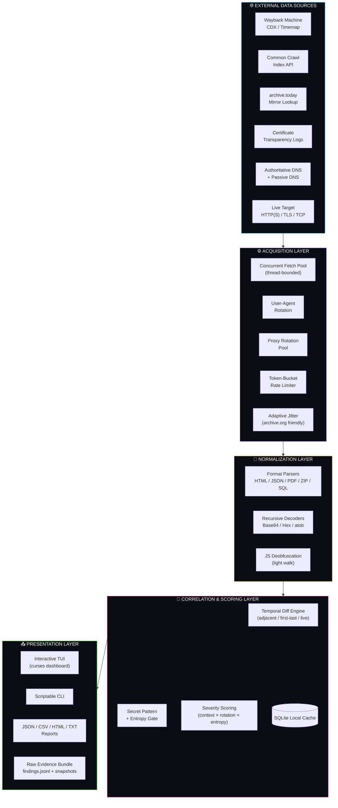

### Layer Responsibilities

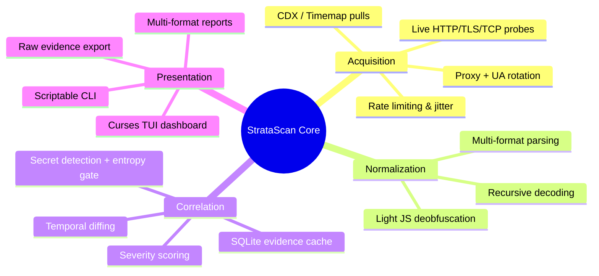

### Component Interaction (Class-Level View)

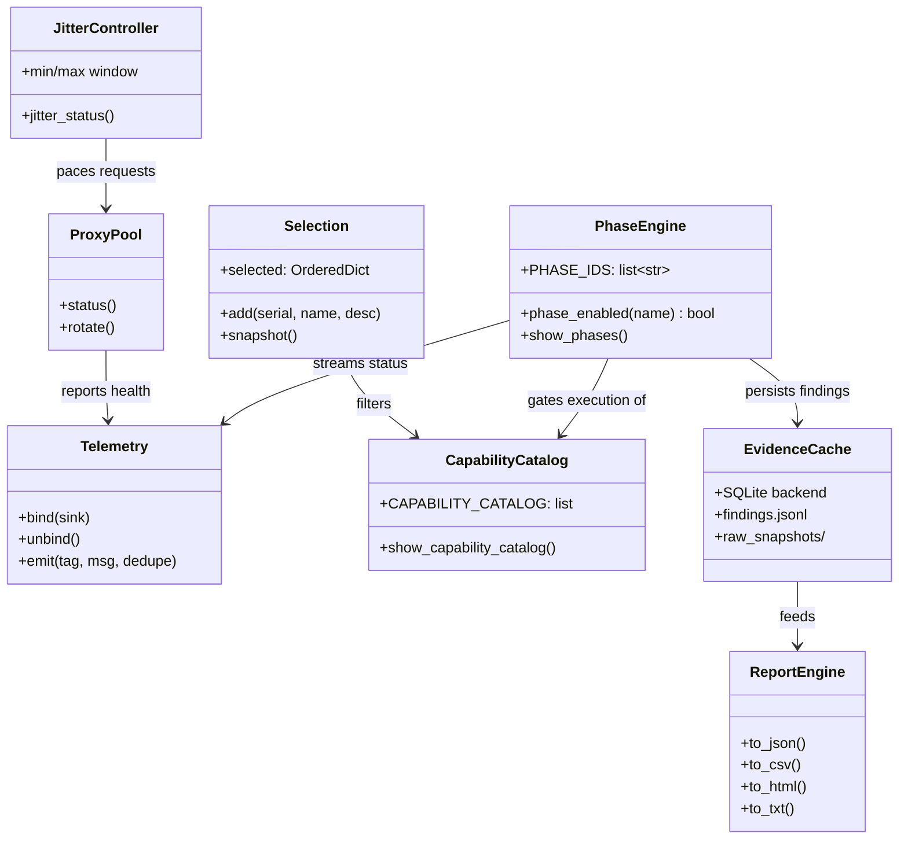

---

## 🧭 Design Philosophy

StrataScan is built on five non-negotiable engineering principles:

### 1. Passive before active
Every scan begins with archive-only reconnaissance. Nothing is sent to the live target until historical acquisition is complete. This means a full attack-surface map can be built **with zero packets sent to the target at all**, if the operator chooses to disable live-verification phases.

### 2. Everything is evidence-graded
No finding is presented as a bare string. Every secret, every subdomain, every deleted path carries **provenance** — first-seen timestamp, last-seen timestamp, source archive, and a severity score derived from context, entropy, and rotation likelihood.

### 3. Idempotent, cache-first execution
A local SQLite cache means a scan can be interrupted, resumed, or re-run without re-fetching unchanged data. Partial reports are flushed automatically on interrupt (`Ctrl+C`).

### 4. Composable, not monolithic
205+ capabilities map onto 47 phases, and both are independently selectable. An operator can run *only* secret-scanning phases, *only* DNS phases, or the full pipeline — the engine degrades gracefully to whatever subset is selected, including automatic dependency resolution (selecting a capability pulls in the phases it depends on).

### 5. Archive-respectful by default
Because the primary data source — the Wayback Machine — is a shared public good run by a nonprofit, StrataScan enforces **adaptive jitter** and **conservative concurrency** against archive.org endpoints by default. Aggressive scanning against the live target is opt-in; being a good citizen of the archive ecosystem is not.

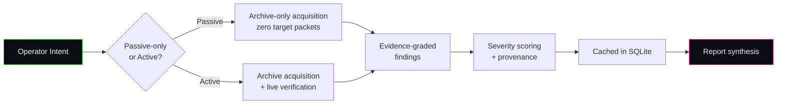

---

## The Capability Catalog

StrataScan ships **198 individually selectable capabilities**, organized into 8 functional domains. Every capability can be toggled independently via the `select` command, and selecting any capability automatically pulls in whatever pipeline phases it depends on.

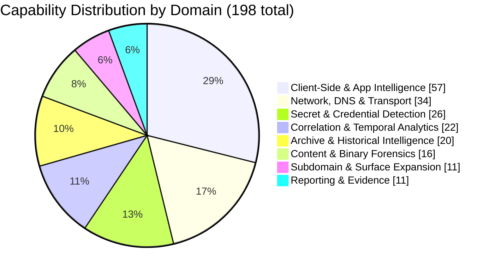

### 5.1 Archive & Historical Intelligence

*Everything that mines the Wayback Machine, Common Crawl, and independent archives for a domain's complete historical footprint — the raw material every other layer builds on.*

<details><summary><strong>Expand 20 capabilities</strong></summary>

| # | Capability | What it does | Key |
|---|---|---|---|
| 1 | **CDX index fetch** | Pull every snapshot record for the target domain | `cdx` |
| 2 | **CDX full-field query** | urlkey, offset, filename, redirect fields | `cdx_full` |
| 3 | **CDX filter language** | statuscode/mimetype/regex filters | `cdx_filter` |
| 4 | **CDX prefix query** | matchType=prefix path enumeration | `cdx_prefix` |
| 5 | **CDX timeline per URL** | Full status history per URL | `timeline` |
| 6 | **Calendar captures API** | Per-day snapshot density | `calendar` |
| 7 | **Anchor text search** | Which URLs referenced a term | `anchor` |
| 8 | **Availability API** | Nearest-snapshot lookup | `availability` |
| 9 | **Snapshot sparkline** | Per-year snapshot density | `sparkline` |
| 10 | **Memento TimeMap (link)** | Machine-readable snapshot list | `timemap` |
| 11 | **Memento TimeMap (JSON)** | JSON-format TimeMap | `timemap_json` |
| 12 | **Memento aggregator** | Multi-archive TimeMap | `memento_agg` |
| 13 | **Archive.today lookup** | Independent snapshot lookup | `archive_today` |
| 14 | **Common Crawl query** | Independent crawl history | `common_crawl` |
| 15 | **Archive exclusion detection** | X-Robots-Tag noarchive/noindex | `exclusions` |
| 16 | **X-Archive-Src extraction** | WARC collection identifier | `archive_src` |
| 17 | **Revisit detection** | warc/revisit records | `revisit` |
| 18 | **Capture timeline** | Snapshots by month | `timeline_monthly` |
| 19 | **Capture gap detection** | Periods with no snapshots | `gaps` |
| 20 | **First/last seen** | Earliest and latest snapshot | `first_last_seen` |

</details>

### 5.2 Network, DNS & Transport Security

*Live and historical probing of DNS, TLS, and transport-layer configuration — the infrastructure fingerprint of the target, past and present.*

<details><summary><strong>Expand 35 capabilities</strong></summary>

| # | Capability | What it does | Key |
|---|---|---|---|
| 1 | **Certificate Transparency (crt.sh)** | Subdomain lookup | `crt` |
| 2 | **RDAP WHOIS** | Modern JSON WHOIS | `rdap` |
| 3 | **WHOIS via port 43** | Legacy WHOIS with referral | `whois` |
| 4 | **Live status probing** | HEAD every archived URL | `live_status` |
| 5 | **Live header harvest** | Full HTTP response headers | `headers` |
| 6 | **Header summary** | Aggregate servers, security, CDN, cookies | `header_summary` |
| 7 | **Archived header extraction** | X-Archive-Orig-* headers per snapshot | `archived_headers` |
| 8 | **Archived header diff** | Historical Server/CSP/cookie changes | `archived_header_diff` |
| 9 | **Cookie flag analysis** | Secure, HttpOnly, SameSite | `cookie_flags` |
| 10 | **TLS certificate info** | Subject, issuer, SANs, validity | `tls` |
| 11 | **TLS version enumeration** | TLS 1.0/1.1/1.2/1.3 support | `tls_versions` |
| 12 | **TLS cipher enumeration** | Weak/strong cipher support | `tls_ciphers` |
| 13 | **Certificate chain validation** | Broken/incomplete chains | `tls_chain` |
| 14 | **OCSP/CRL check** | Revocation support | `ocsp` |
| 15 | **HSTS preload check** | Preload list membership | `hsts_preload` |
| 16 | **DNS resolution** | Live IPv4 + IPv6 | `dns` |
| 17 | **DNS full record lookup** | A/AAAA/CNAME/MX/NS/SOA/TXT/CAA | `dns_full` |
| 18 | **DNS SRV enumeration** | Service location records | `srv` |
| 19 | **DNS TLSA lookup** | DANE cert fingerprints | `tlsa` |
| 20 | **DNS SMIMEA lookup** | S/MIME cert fingerprints | `smimea` |
| 21 | **DKIM selector enumeration** | Reveals mail provider | `dkim` |
| 22 | **BIMI records** | Brand Indicators for Message Identification | `bimi` |
| 23 | **DNSSEC validation** | Signing status | `dnssec` |
| 24 | **Zone transfer attempt** | AXFR test | `axfr` |
| 25 | **Reverse DNS lookup** | PTR from IP | `ptr` |
| 26 | **Wildcard DNS detection** | Random subdomain probe | `wildcard` |
| 27 | **ASN lookup** | Network ownership | `asn` |
| 28 | **TCP port scan** | Open ports on resolved IPs | `ports` |
| 29 | **HTTP/2 detection** | Protocol version | `http2` |
| 30 | **WAF fingerprinting** | Cloudflare, Akamai, Sucuri | `waf` |
| 31 | **CORS misconfiguration** | Access-Control-Allow-Origin: * | `cors` |
| 32 | **Rate limit header parsing** | API quota hints | `ratelimit` |
| 33 | **Robtex passive DNS** | Free passive DNS history | `robtex` |
| 34 | **Mnemonic Passive DNS** | Free passive DNS | `mnemonic_pdns` |
| 35 | **HackerTarget API** | Reverse IP, DNS lookup | `hackertarget` |

</details>

### 5.3 Subdomain & Surface Expansion

*Techniques for discovering the full breadth of a target's hostnames and URL-space, combining archive-sourced names with pattern-based and wordlist-based expansion.*

<details><summary><strong>Expand 11 capabilities</strong></summary>

| # | Capability | What it does | Key |
|---|---|---|---|
| 1 | **Subdomain enumeration** | Every subdomain in CDX | `subdomains` |
| 2 | **Subdomain first/last seen** | Timeline stats per subdomain | `subdomain_stats` |
| 3 | **Subdomain takeover probe** | Dead subdomains claimable | `takeover` |
| 4 | **Subdomain permutation** | dev-, staging-, api- patterns | `subdomain_perm` |
| 5 | **Subdomain brute-force** | Wordlist-based DNS enumeration | `subdomain_brute` |
| 6 | **Case variant enumeration** | /About vs /about vs /ABOUT | `case_variant` |
| 7 | **Slash variant enumeration** | /page vs /page/ | `slash_variant` |
| 8 | **Scheme variant enumeration** | http vs https | `scheme_variant` |
| 9 | **Port variant enumeration** | :80 vs :8080 | `port_variant` |
| 10 | **Subdomain cross-reference** | First/last seen per subdomain | `subdomain_crossref` |
| 11 | **External domain graph** | External hosts seen | `external_domain_graph` |

</details>

### 5.4 Content, Document & Binary Forensics

*Deep parsing of non-HTML artifacts — documents, images, archives, keys, and dumps — that archives happened to capture.*

<details><summary><strong>Expand 16 capabilities</strong></summary>

| # | Capability | What it does | Key |
|---|---|---|---|
| 1 | **Document harvesting** | Every archived document | `documents` |
| 2 | **PDF metadata extraction** | Author, XMP, producer | `pdf_meta` |
| 3 | **Office metadata extraction** | Author, company | `office_meta` |
| 4 | **Office macro detection** | VBA macro presence | `office_macros` |
| 5 | **Image EXIF extraction** | GPS, camera, software | `exif` |
| 6 | **PNG chunk extraction** | Text chunks | `png_chunks` |
| 7 | **SVG embedded JS detection** | XSS vectors | `svg_js` |
| 8 | **ZIP internal listing** | Contained files | `zip_listing` |
| 9 | **TAR internal listing** | Contained files | `tar_listing` |
| 10 | **SQL dump parsing** | Tables, columns, sample rows | `sql_dump` |
| 11 | **Log file parsing** | Usernames, IPs, paths | `log_parse` |
| 12 | **PEM/CRT/KEY parsing** | Cert/key material | `pem_parse` |
| 13 | **PGP key parsing** | UID, email, fingerprint | `pgp` |
| 14 | **SSH key fingerprinting** | SHA-256 fingerprint | `ssh_key` |
| 15 | **Torrent file parsing** | Trackers, file list | `torrent` |
| 16 | **ICS calendar parsing** | Events, attendees | `ics` |

</details>

### 5.5 Client-Side & Application Intelligence

*Everything extractable from HTML, JavaScript, and application metadata: structure, frameworks, hidden state, and third-party integrations.*

<details><summary><strong>Expand 57 capabilities</strong></summary>

| # | Capability | What it does | Key |
|---|---|---|---|
| 1 | **RSS/Atom feed parsing** | Content feed extraction | `rss` |
| 2 | **robots.txt parsing** | User-agents, disallow, allow, sitemaps | `robots_parsed` |
| 3 | **robots.txt historical diff** | New disallow rules over time | `robots_diff` |
| 4 | **sitemap.xml parsing** | URLs, nested sitemaps, lastmods | `sitemap_parsed` |
| 5 | **sitemap.xml historical diff** | New/removed URLs over time | `sitemap_diff` |
| 6 | **Special file probing** | well-known sensitive paths | `special_files` |
| 7 | **Special file content scan** | Fetch + scan every hit for secrets | `special_scan` |
| 8 | **Framework endpoint enumeration** | framework-specific paths | `framework_endpoints` |
| 9 | **Page intelligence** | Title, generator, canonical, meta, headings | `page_intel` |
| 10 | **Email extraction** | Every email found | `emails` |
| 11 | **Phone extraction** | Context-anchored phones | `phones` |
| 12 | **Social link extraction** | Every social profile | `social_links` |
| 13 | **Internal/external links** | Link graph per page | `links` |
| 14 | **JS file discovery** | Every script src | `js_files` |
| 15 | **CSS file discovery** | Every stylesheet | `css_files` |
| 16 | **Image discovery** | Every img src | `images` |
| 17 | **Iframe discovery** | Every iframe src | `iframes` |
| 18 | **Form + input extraction** | Every form + input | `forms` |
| 19 | **API endpoint discovery** | Every /api/... string | `api_endpoints` |
| 20 | **GraphQL endpoint discovery** | /graphql, /gql, /query | `graphql_endpoints` |
| 21 | **CMS fingerprinting** | CMS signatures | `cms` |
| 22 | **Analytics ID extraction** | GA, GA4, GTM, FB Pixel | `analytics` |
| 23 | **Hidden element extraction** | display:none, aria-hidden, hidden inputs | `hidden` |
| 24 | **HTML comment extraction** | Every comment with context | `comments` |
| 25 | **CSS comment extraction** | Every CSS comment | `css_comments` |
| 26 | **JS comment extraction** | Every JS comment | `js_comments` |
| 27 | **Data attribute extraction** | data-* attributes | `data_attrs` |
| 28 | **ARIA label extraction** | aria-label, aria-description | `aria` |
| 29 | **Title attribute extraction** | title= tooltips | `title_attr` |
| 30 | **Image alt text extraction** | alt= attributes | `alt_text` |
| 31 | **Placeholder text extraction** | placeholder= attributes | `placeholder` |
| 32 | **window.__INITIAL_STATE__ parsing** | App state from JS | `initial_state` |
| 33 | **__NEXT_DATA__ parsing** | Next.js SSR state | `next_data` |
| 34 | **__NUXT__ parsing** | Nuxt SSR state | `nuxt_data` |
| 35 | **Base64 data URI decoding** | Decode base64 data URIs | `data_uri` |
| 36 | **Nonce/CSRF extraction** | Nonces and CSRF tokens | `nonce` |
| 37 | **Pingback/webmention links** | Pingback, webmention endpoints | `pingback` |
| 38 | **Preconnect/prefetch domains** | Third-party domains | `preconnect` |
| 39 | **Analytics event extraction** | Track/send/log calls | `analytics_events` |
| 40 | **JS error message extraction** | throw new Error strings | `js_errors` |
| 41 | **WebSocket URL extraction** | wss:// endpoints | `ws_urls` |
| 42 | **GraphQL query extraction** | query/mutation strings | `gql_queries` |
| 43 | **Environment name extraction** | production/staging/dev | `env_names` |
| 44 | **Version number extraction** | Semantic versions | `versions` |
| 45 | **Console log extraction** | console.log strings | `console_logs` |
| 46 | **JSON-LD extraction** | Structured data blocks | `jsonld` |
| 47 | **Feed link discovery** | RSS/Atom feeds | `feeds` |
| 48 | **Manifest discovery** | PWA manifest | `manifest` |
| 49 | **Hreflang extraction** | i18n alternates | `hreflang` |
| 50 | **SRI hash extraction** | Subresource Integrity | `sri` |
| 51 | **CSP parsing** | Directive-by-directive | `csp_parse` |
| 52 | **Source-map reference extraction** | sourceMappingURL refs | `sourcemaps` |
| 53 | **Source map fetching** | Fetch .js.map and scan | `source_maps` |
| 54 | **JS bundle harvesting** | Fetch every .js and scan | `js_bundles` |
| 55 | **JS deobfuscation** | Basic walk on minified JS | `js_deobfuscate` |
| 56 | **Google/Bing dork generation** | Search engine dorks | `dorks` |
| 57 | **Disallow cross-reference** | robots.txt paths that were archived | `disallow_xref` |

</details>

### 5.6 Secret, Credential & Leak Detection

*Pattern- and entropy-based detection of credentials, keys, and tokens, with provenance and severity scoring attached to every hit.*

<details><summary><strong>Expand 26 capabilities</strong></summary>

| # | Capability | What it does | Key |
|---|---|---|---|
| 1 | **Secret scanning** | secret patterns | `secrets` |
| 2 | **Base64 auto-decode** | Decode + rescan base64 | `b64` |
| 3 | **Hex auto-decode** | Decode + rescan hex | `hex` |
| 4 | **Email permutation generation** | Corporate email guesses | `email_perm` |
| 5 | **Email MX validation** | Mail server check | `email_mx` |
| 6 | **Catch-all email detection** | Wildcard mail behavior | `catchall` |
| 7 | **Secret age estimation** | First/last seen per secret | `secret_age` |
| 8 | **Entropy gate** | Filter low-entropy secret matches | `entropy` |
| 9 | **Structural env parser** | .env KEY=VALUE extraction | `env_parser` |
| 10 | **WP config parser** | wp-config.php constants | `wp_parser` |
| 11 | **Django settings parser** | PASSWORD fields | `django_parser` |
| 12 | **Docker env block parser** | docker-compose environment | `docker_parser` |
| 13 | **JSON tree walker** | Recursive JSON secret extraction | `json_walker` |
| 14 | **Source map sourcesContent** | Extract per-file source | `source_content` |
| 15 | **atob/Buffer.from decoder** | Decode JS-embedded base64 | `atob` |
| 16 | **JWT claim extractor** | iss/aud/sub/role/exp | `jwt_claims` |
| 17 | **URL param credential scan** | token=, key=, password=, pwd= | `url_param_creds` |
| 18 | **Cookie JWT detection** | Session cookies carrying JWTs | `cookie_jwt` |
| 19 | **Header secret extraction** | X-Api-Key, Authorization echoes | `header_secrets` |
| 20 | **Basic auth URL extraction** | user:pass@host | `basic_auth_url` |
| 21 | **Stack trace parser** | Error pages leaking config | `stack_trace` |
| 22 | **phpinfo parser** | Table-structured phpinfo output | `phpinfo_parse` |
| 23 | **Cloud metadata leak** | 169.254.169.254 references | `cloud_meta` |
| 24 | **Credential provenance** | First/last seen, context, rotation | `cred_provenance` |
| 25 | **Credential severity scoring** | severity x context x rotation | `cred_score` |
| 26 | **Ignore allowlist** | .stratascan_ignore file | `ignore_file` |

</details>

### 5.7 Correlation, Diffing & Temporal Analytics

*Cross-snapshot and cross-scan analytics that turn raw historical data into trends, deltas, and anomalies.*

<details><summary><strong>Expand 22 capabilities</strong></summary>

| # | Capability | What it does | Key |
|---|---|---|---|
| 1 | **Deletion classification** | removed/gone/legal/blocked/redirected/offline | `deletion_class` |
| 2 | **Deletion window detection** | Bracket when each URL disappeared | `deletion_window` |
| 3 | **Mass deletion clustering** | Group URLs deleted in same window | `mass_deletion` |
| 4 | **First vs last diff** | Diff earliest and latest snapshot body | `first_last_diff` |
| 5 | **Adjacent snapshot diffs** | Diff every adjacent snapshot pair | `adjacent_diff` |
| 6 | **Wayback vs live diff** | Compare last archive with live | `wayback_live_diff` |
| 7 | **Redirect history** | 301/302/303/307/308 events | `redirects` |
| 8 | **Content-type breakdown** | Mimetype frequency | `content_types` |
| 9 | **Status code breakdown** | HTTP status frequency | `status_codes` |
| 10 | **URL depth distribution** | Path segments per URL | `url_depths` |
| 11 | **Query parameter frequency** | Query params across URLs | `query_params` |
| 12 | **File extension frequency** | File extensions across URLs | `file_extensions` |
| 13 | **Digest change rate** | Content churn ratio | `churn` |
| 14 | **Digest clustering** | Duplicate content graph | `digest_cluster` |
| 15 | **URLKey analysis** | SURT-form dedup | `urlkey` |
| 16 | **Snapshot count ranking** | Importance proxy | `snapshot_rank` |
| 17 | **Resurrection map** | Removed URL -> last live snapshot | `resurrection` |
| 18 | **Link rot quantification** | Ratio of dead outbound links | `link_rot` |
| 19 | **Query param evolution** | Query params over time per path | `query_param_evolution` |
| 20 | **Form endpoint history** | Forms aggregated per action | `form_endpoint_history` |
| 21 | **Duplicate site detection** | Digest clusters | `duplicate_site` |
| 22 | **Cross-scan baseline diff** | Compare current vs previous report | `baseline_diff` |

</details>

### 5.8 Reporting & Evidence Management

*Operational plumbing — concurrency control, evidence persistence, and multi-format report synthesis.*

<details><summary><strong>Expand 11 capabilities</strong></summary>

| # | Capability | What it does | Key |
|---|---|---|---|
| 1 | **User-agent rotation** | real UAs | `ua` |
| 2 | **Proxy rotation** | Rotate outbound requests through proxies | `proxy` |
| 3 | **Rate limiting** | Token bucket per host | `rate_limit` |
| 4 | **Adaptive jitter** | Randomized 5-8s throttle for archive.org | `jitter` |
| 5 | **CLI mode** | Scriptable batch scan | `cli` |
| 6 | **TUI mode** | Interactive console | `tui` |
| 7 | **JSON report** | Machine-readable dump | `report_json` |
| 8 | **CSV report** | One row per URL | `report_csv` |
| 9 | **HTML report** | Dark-themed with severity | `report_html` |
| 10 | **TXT report** | Full detailed text report | `report_txt` |
| 11 | **JSONL checkpoint** | Append-only record log per scan | `jsonl` |

</details>


---

## ⚔️ Offensive Capability Profile

This section describes StrataScan's value to an **authorized Gray-Team operator, bug-bounty researcher, or penetration tester** mapping a target's attack surface. Every capability listed here is passive-source or read-only-active; none of it performs exploitation.

### 6.1 Attack-surface cartography

StrataScan's primary offensive value is producing a **more complete attack surface than any single live scan can**. Because subdomains, endpoints, and forms are sourced from years of archive crawls in addition to brute-force and permutation, an operator routinely discovers:

- Decommissioned-but-still-resolving subdomains (`dev-`, `staging-`, `old-`, `test-`) that were never properly retired.
- API and GraphQL endpoints that only ever appeared in a JS bundle that was archived once, years ago.
- Forms and parameters that existed on a since-redesigned page, useful for understanding legacy backend behavior.
- Subdomains eligible for **takeover** — a DNS record still points at a de-provisioned cloud resource (S3 bucket, Heroku app, Azure endpoint, etc.).

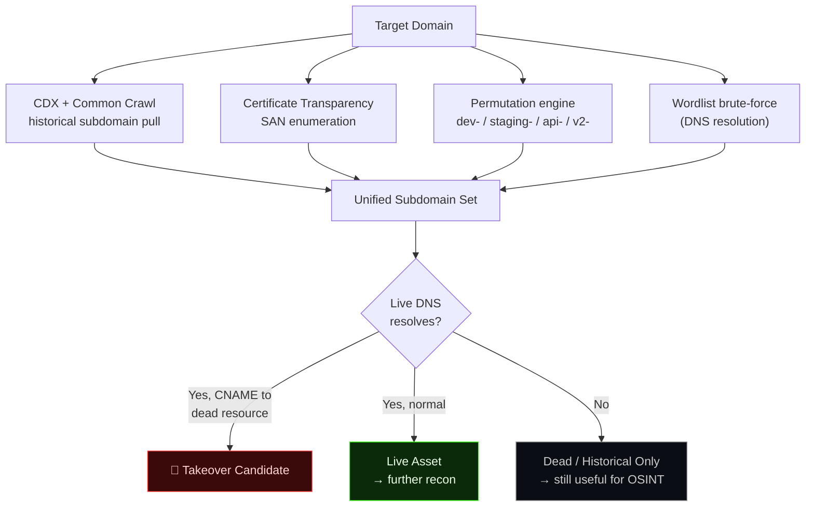

### 6.2 Historical secret archaeology

The single highest-leverage offensive capability: **secrets don't need to still be on the live site to be dangerous**. A `.env` file, an AWS key in a JS bundle, or a database password in a source map that was live for even one crawl cycle is **permanently retrievable** from the archive, regardless of whether the live team "fixed" it.

StrataScan's secret pipeline:

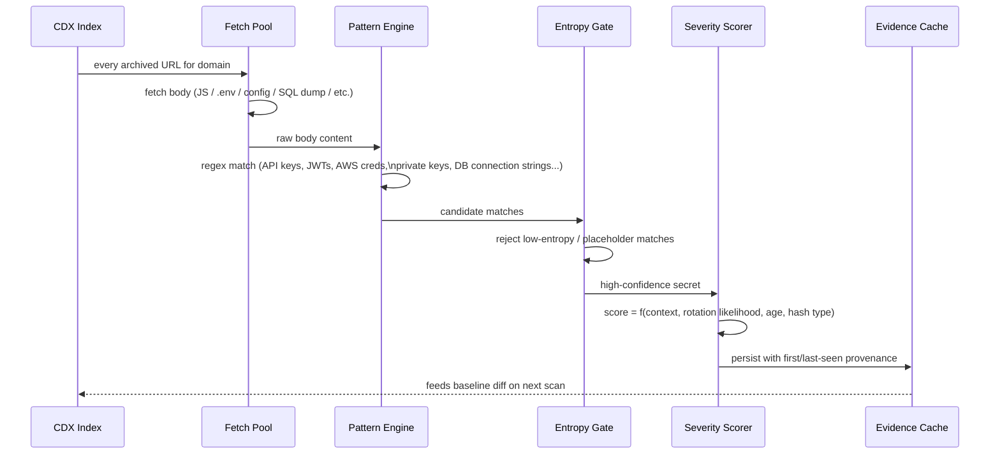

Specific offensive detection classes include live JWT claim extraction (issuer/audience/role/expiry), basic-auth URLs (`user:pass@host`), cloud metadata endpoint leaks (`169.254.169.254`), framework-specific config parsing (`wp-config.php`, Django `settings.py`, `docker-compose` environment blocks), and hashed-credential fingerprinting (bcrypt/argon2/scrypt/pbkdf2/md5crypt) for offline crackability assessment.

### 6.3 Infrastructure drift & migration-window exposure

By diffing TLS configuration, HTTP headers, CMS fingerprints, and DNS records across every archived snapshot, StrataScan surfaces **migration windows** — the period during a platform change when old and new infrastructure overlap, legacy endpoints are forgotten, and security headers regress. These windows are disproportionately where exploitable misconfigurations live.

### 6.4 Reconnaissance without touching the target

Because acquisition is archive-first, an operator can build a near-complete picture of a target's historical infrastructure, subdomain footprint, and exposed secrets **before sending a single packet to the live target** — valuable for engagements with strict pre-authorization scoping, or for maintaining a low footprint during the intelligence-gathering phase of an engagement.

### 6.5 Offensive capability summary table

| Objective | StrataScan Mechanism | Output |
|---|---|---|
| Enumerate full subdomain history | CDX + CT logs + permutation + brute-force | De-duplicated subdomain set with first/last seen |
| Find forgotten/dead infrastructure | Live-resolution cross-reference | Takeover candidates, dead asset inventory |
| Recover historical secrets | Regex + entropy + severity scoring across all archived bodies | Scored, provenance-tagged credential list |
| Map hidden API surface | JS bundle + source map harvesting, endpoint regex | API/GraphQL endpoint inventory |
| Identify weak TLS/legacy config | TLS version/cipher enumeration, header diffing | Timeline of crypto posture |
| Discover deliberately hidden content | `robots.txt`/sitemap historical diff, deletion forensics | Paths the target tried to hide, and when |
| Build email attack vectors | Permutation + MX/catch-all validation | Verified corporate email patterns |
| Generate search-engine dorks | Pattern-derived dork generation | Ready-to-run Google/Bing dorks for the target |

---

## 🛡 Defensive & Protective Behavior

StrataScan is equally designed as a **self-audit and gray-team instrument**. Every offensive capability above has a mirrored defensive use: an organization running StrataScan against its own domains discovers exactly what an attacker using the same tool would discover — before they do.

### 7.1 Defensive use cases

| Gray-Team Question | How StrataScan Answers It |
|---|---|
| "Did we ever leak a credential, even briefly?" | Full historical secret scan across every archived snapshot, not just the current site |
| "Is any decommissioned subdomain still pointing at a resource we no longer control?" | Takeover probing across the entire historical subdomain set |
| "What did our security headers / TLS posture look like over time?" | Header and TLS diffing across the full snapshot timeline |
| "Did a deletion correlate with an incident?" | Deletion-window detection + mass-deletion clustering |
| "What would a search-engine dork reveal about us?" | Dork generation run against our own domain, pre-emptively |
| "Are our `.env` / config patterns detectable by automated scanners?" | Structural parsers for `.env`, `wp-config.php`, Django settings, Docker Compose |
| "What changed since our last audit?" | Baseline diff against a previous JSON report |

### 7.2 Built-in operational safeguards (protecting *others*, not just the operator)

StrataScan embeds several behaviors whose purpose is to prevent the tool itself from becoming a nuisance or liability:

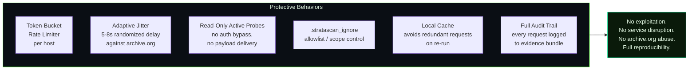

- **Rate limiting** — a token-bucket limiter is applied per host, preventing any single target (or the archive.org API) from receiving burst traffic.
- **Adaptive jitter** — requests against `archive.org` are deliberately randomized within a configurable window (default 5–8s) specifically to avoid being a burden on a shared nonprofit resource.
- **Read-only active checks** — every live-target interaction is a `HEAD`/`GET`/TLS-handshake/DNS-query class operation. There is no credential brute-forcing, no injection testing, no payload delivery, and no write/modify operation against any remote system anywhere in the codebase.
- **Scope control via ignore-lists** — a `.stratascan_ignore` file lets an operator explicitly exclude hosts, paths, or patterns from a scan, enforcing engagement scope at the tool level.
- **Zone-transfer and wildcard checks are diagnostic, not destructive** — an `AXFR` attempt is a standard, passive-from-the-target's-perspective DNS query; a misconfigured server exposing a zone transfer is a finding about *their* exposure, not an action StrataScan forces.
- **Full request logging and raw evidence export** — every request StrataScan makes is recorded, timestamped, and exportable, supporting after-the-fact audit of exactly what was done during an engagement — essential for staying inside authorized scope and for client-facing proof of non-destructive methodology.
- **Local-only credential handling** — detected secrets are written to local evidence files (SQLite cache, `findings.jsonl`) and are never transmitted anywhere by the tool itself.

### 7.3 Credential hygiene features

Because the secret-detection engine inevitably surfaces live, sensitive material, StrataScan treats detected credentials as **data to be handled carefully, not displayed carelessly**:

- Findings carry **provenance** (first/last seen, source URL) so a defender can immediately locate and rotate the exposed credential.
- **Severity scoring** (context × entropy × rotation likelihood) lets a defender triage hundreds of historical findings by actual risk instead of raw match count.
- **Hashed-password detection** is classified by algorithm (bcrypt/argon2/scrypt/pbkdf2/md5crypt) so a defender can immediately assess crackability and urgency, without StrataScan attempting to crack anything itself.
- The **entropy gate** suppresses low-confidence matches (placeholder strings, example keys, test fixtures), reducing false-positive fatigue — a defensive usability feature as much as an offensive precision feature.

### 7.4 Why "offense" and "defense" are the same code path here

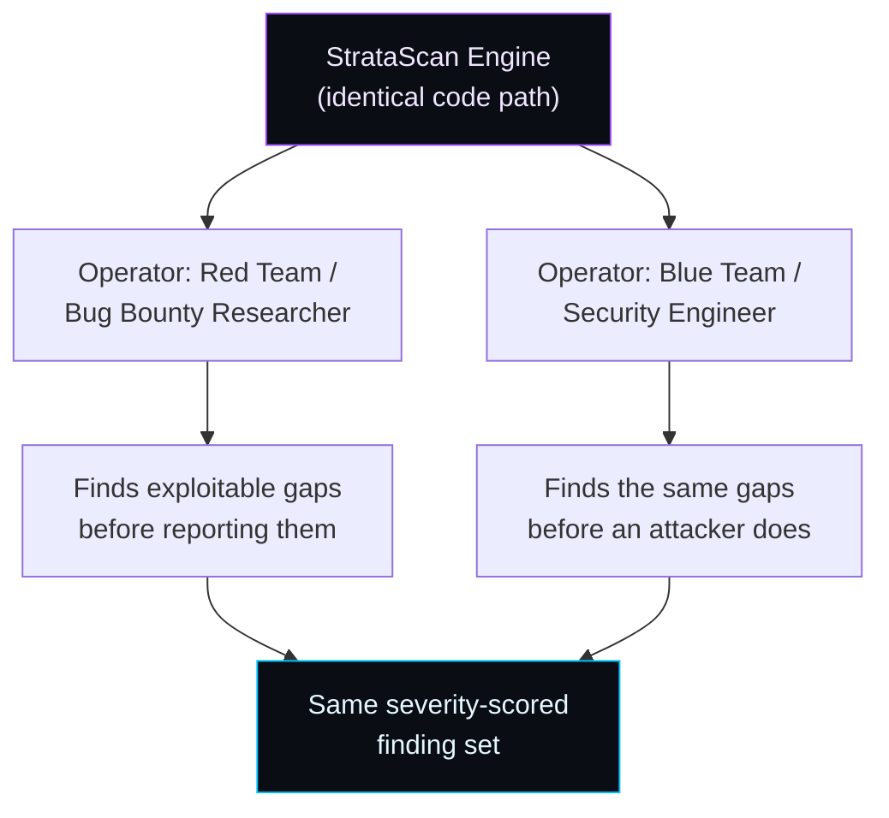

The tool makes no assumption about operator intent. What determines whether a run is "offensive" or "defensive" is **authorization and target ownership** — covered in [Legal & Ethical Use](#-legal--ethical-use) — not any difference in the underlying mechanism.

---

## The 47-Phase Pipeline

StrataScan executes a fixed-order **48-phase pipeline**. Each phase is independently toggleable (`phase p1,p5,p9`), and phases are automatically pulled in as dependencies when their capabilities are selected individually.

| Phase | Name | Stage |
|---|---|---|
| p01 | FETCHING CDX INDEX | 🗂 Acquisition |
| p02 | PROBING LIVE STATUS | 🗂 Acquisition |
| p03 | MAPPING TOPOLOGY | 🗂 Acquisition |
| p04 | HARVESTING HTTP HEADERS | 🗂 Acquisition |
| p05 | TLS / DNS RECON | 🗂 Acquisition |
| p06 | WAYBACK / ARCHIVE ENDPOINTS | 🗂 Acquisition |
| p07 | CERTIFICATE TRANSPARENCY | 🗂 Acquisition |
| p08 | WHOIS / RDAP | 🗂 Acquisition |
| p09 | DNS FULL RECORDS | 🗂 Acquisition |
| p10 | PASSIVE DNS SOURCES | 🗂 Acquisition |
| p11 | SPECIAL FILES | 📄 Content Parsing |
| p12 | SCANNING SPECIAL FILE CONTENTS | 📄 Content Parsing |
| p13 | PARSING ROBOTS / SITEMAP | 📄 Content Parsing |
| p14 | CONTENT INTEL | 📄 Content Parsing |
| p15 | JS BUNDLE HARVESTING | 📄 Content Parsing |
| p16 | SOURCE MAP HARVESTING | 📄 Content Parsing |
| p17 | JS DEOBFUSCATION | 📄 Content Parsing |
| p18 | DELETION FORENSICS | 🔍 Forensics & Discovery |
| p19 | SUBDOMAIN TAKEOVER PROBE | 🔍 Forensics & Discovery |
| p20 | ADJACENT SNAPSHOT DIFFS | 🔍 Forensics & Discovery |
| p21 | WAYBACK VS LIVE DIFF | 🔍 Forensics & Discovery |
| p22 | ARCHIVED HEADERS | 🔍 Forensics & Discovery |
| p23 | DOCUMENT METADATA | 🔍 Forensics & Discovery |
| p24 | FRAMEWORK ENDPOINTS | 🔍 Forensics & Discovery |
| p25 | CLOUD BUCKET ENUMERATION | 🔍 Forensics & Discovery |
| p26 | DORK GENERATION | 🔍 Forensics & Discovery |
| p27 | ROBOTS/SITEMAP HISTORICAL DIFF | 🔍 Forensics & Discovery |
| p28 | SUBDOMAIN PERMUTATION + BRUTE | 🧩 Expansion & Correlation |
| p29 | EMAIL PERMUTATIONS + MX | 🧩 Expansion & Correlation |
| p30 | VARIANT ENUMERATION | 🧩 Expansion & Correlation |
| p31 | RESURRECTION MAP | 🧩 Expansion & Correlation |
| p32 | LINK ROT QUANTIFICATION | 🧩 Expansion & Correlation |
| p33 | QUERY PARAM EVOLUTION | 🧩 Expansion & Correlation |
| p34 | SECRET AGE ESTIMATION | 🧩 Expansion & Correlation |
| p35 | FORM ENDPOINT HISTORY | 🧩 Expansion & Correlation |
| p36 | EXTERNAL DOMAIN GRAPH | 🧩 Expansion & Correlation |
| p37 | DUPLICATE SITE DETECTION | 🧩 Expansion & Correlation |
| p38 | REVISIT RECORD ANALYSIS | 📊 Advanced Correlation |
| p39 | URLKEY / SURT ANALYTICS | 📊 Advanced Correlation |
| p40 | SNAPSHOT DENSITY RANKING | 📊 Advanced Correlation |
| p41 | REDIRECT CHAIN RECONSTRUCTION | 📊 Advanced Correlation |
| p42 | PASSIVE CRAWL CORRELATION | 📊 Advanced Correlation |
| p43 | PAGE TREE RECONSTRUCTION | 📊 Advanced Correlation |
| p44 | DUPLICATE SECRET COLLAPSE | 📦 Evidence & Reporting |
| p45 | CREDENTIAL CORRELATION | 📦 Evidence & Reporting |
| p46 | RAW EVIDENCE EXPORT | 📦 Evidence & Reporting |
| p47 | COVERAGE REPORT | 📦 Evidence & Reporting |
| p48 | CACHE WARMUP |  |

### Pipeline flow, by stage

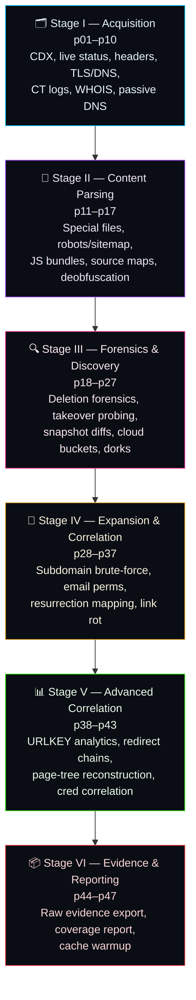

### Phase state machine

Each phase independently transitions through the same lifecycle, visible live in the TUI dashboard:

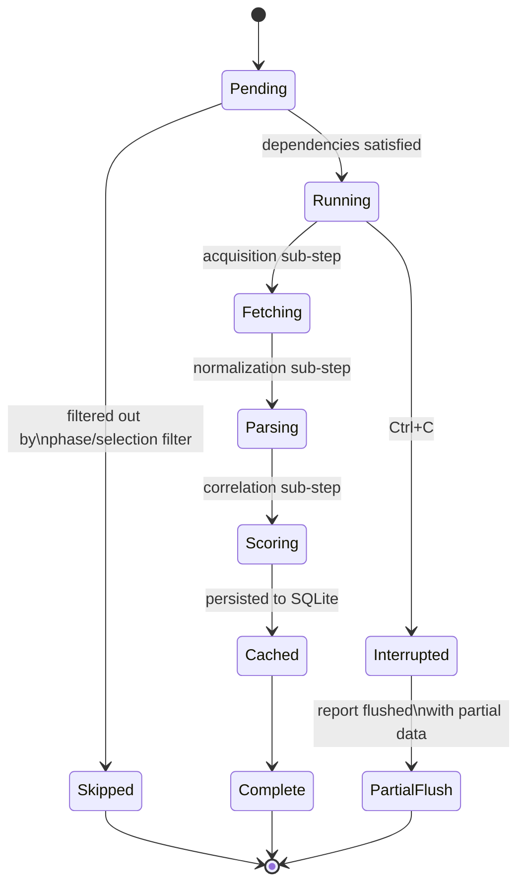

---

## 🔀 Data Flow & Sequence Diagrams

### End-to-end scan sequence

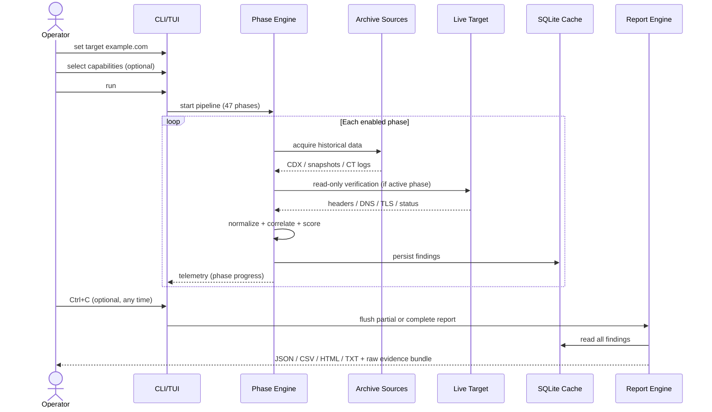

### Secret-discovery data flow

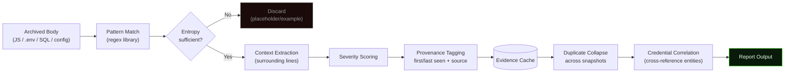

### Subdomain resolution decision tree

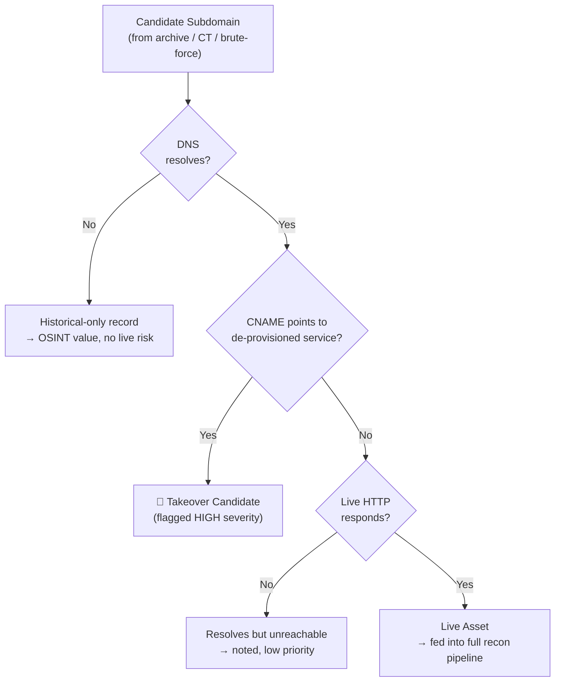

---

## Interfaces

StrataScan ships two first-class interfaces built on the exact same engine:

```mermaid
flowchart LR
    subgraph ENTRY["Entry Point"]
        ARGV{"sys.argv has\nnon-flag arg?"}
    end
    ARGV -->|Yes| CLI["CLI Mode\nrun_cli()\nscriptable, batch-friendly"]
    ARGV -->|No| TUI["TUI Mode\nrun_tui()\ncurses dashboard"]

    CLI --> OUT1["stdout + report files"]
    TUI --> OUT2["Live log panel\n+ stats panel\n+ help panel\n+ command bar"]

    style CLI fill:#0a0e14,stroke:#00c2ff,color:#e6f7ff
    style TUI fill:#0a0e14,stroke:#9d4dff,color:#f0e6ff
```

### CLI Mode
Pass a target as the first non-flag argument and StrataScan runs headless — ideal for CI pipelines, scheduled audits, and scripted bug-bounty workflows.

### TUI Mode
Launching with no arguments drops into a full curses-based dashboard: a scrollable live log panel, a real-time stats panel (phase progress, proxy pool health, jitter window, capability counters), a contextual help panel, and a command bar supporting the full command grammar (`select`, `phase`, `proxy load`, `raw on`, `baseline`, `jitter min/max`, and more).

---

## 📦 Installation

StrataScan is a single-file, dependency-light Python 3.9+ tool built entirely on the standard library (`curses`, `sqlite3`, `ssl`, `socket`, `urllib`, `concurrent.futures`) — there is no package footprint to install.

```bash
# Clone
git clone https://github.com/your-org/stratascan.git
cd stratascan

# (Optional) create an isolated environment
python3 -m venv .venv
source .venv/bin/activate

# No third-party dependencies required — standard library only
python3 stratascan.py --help
```

### Requirements

| Requirement | Why |
|---|---|
| Python 3.9+ | f-strings, modern `ssl.TLSVersion`, `concurrent.futures` |
| A real terminal (for TUI mode) | `curses` requires a TTY; CLI mode works anywhere, including CI |
| Outbound internet access | Archive APIs (Wayback/CDX, Common Crawl, CT logs) and optional live-target verification |
| Optional: a proxy list | For proxy rotation (`proxy load all.txt`) |

---

## 🚀 Usage

### Quick start (TUI)

```bash
python3 stratascan.py
```

Then, inside the dashboard:

```
target example.com
run
```

### Quick start (CLI / scriptable)

```bash
python3 stratascan.py example.com --report html --out ./reports
```

### Scoped scan — passive only, secrets + subdomains

```
target example.com
select 1,2,3,138,139,140,141,142,143
run
```

### Full scan with raw evidence export and proxy rotation

```
target example.com
proxy load all.txt
raw on
jitter min 6
jitter max 9
run
```

### Baseline comparison against a previous audit

```
target example.com
baseline reports/example.com-2026-07-01.json
run
```

---

## 🖥 Command Reference

| Command | Effect |
|---|---|
| `target <domain>` | Set the scan target |
| `run` | Execute the pipeline with current phase/capability filters |
| `phases` | List all 47 phases with ON/OFF/EFF status |
| `phase p1,p5,p9` | Restrict execution to specific phases |
| `capabilities` / `show` | List all 198 capabilities |
| `select 1,2,15` | Select specific capabilities (auto-includes dependency phases) |
| `select all` / `select clear` | Reset selection to "run everything" |
| `proxy load <file>` | Load a proxy list for outbound rotation |
| `jitter min <n>` / `jitter max <n>` | Tune the adaptive archive.org throttle window |
| `raw on` / `raw off` | Toggle raw evidence mode (`findings.jsonl` + `raw_snapshots/`) |
| `baseline <file.json>` | Diff this scan against a previous report |
| `report <json\|csv\|html\|txt>` | Choose report output format |
| `Ctrl+C` | Flush a partial report; second `Ctrl+C` force-exits |
| `Ctrl+E` | Jump log view to latest (auto-follow) |
| `q` | Quit (TUI) |

---

## 📑 Report Artifacts

StrataScan produces four interchangeable report formats, plus an optional raw evidence bundle, from the same underlying finding set.

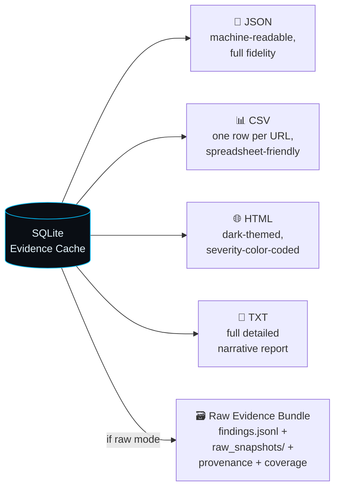

| Format | Best for |
|---|---|
| **JSON** | Pipeline integration, custom tooling, baseline diffing between scans |
| **CSV** | Spreadsheet triage, bulk filtering by severity/host |
| **HTML** | Human-readable deliverable, client-facing reporting, dark-themed with severity coloring |
| **TXT** | Full narrative detail, terminal-friendly, grep-able |
| **Raw Evidence Bundle** | Chain-of-custody evidence, audit trail, forensic reproducibility |

Every report format shares the same underlying record shape — a finding carries its capability key, severity, first/last-seen timestamps, source URL, and (where applicable) matched content — so no information is lost by choosing a "lighter" format.

---

## 🎯 Threat Model

Understanding what StrataScan **does and does not** expose a target to is essential for both operators and the organizations they scan.

| Dimension | StrataScan Behavior |
|---|---|
| **Exploitation** | None. No payload delivery, no injection, no auth bypass, anywhere in the codebase. |
| **Data modification** | None. Every operation — including TLS handshakes, DNS queries, and `AXFR` attempts — is read-only against the target. |
| **Credential use** | StrataScan never attempts to *use* a discovered credential against any service. Detected secrets are reported, not tested. |
| **Denial of service risk** | Mitigated by per-host token-bucket rate limiting; not a design goal of the tool in any configuration. |
| **Archive ecosystem load** | Mitigated by adaptive jitter specifically tuned for archive.org's acceptable-use expectations. |
| **Data at rest** | Findings (including secrets) are cached locally in SQLite / local report files. The tool never transmits findings to any third party. |
| **Attribution** | User-agent rotation and optional proxy rotation reduce target-side fingerprinting of the *scanning activity itself* — a reconnaissance-stealth feature, not an exploitation feature. |
| **Residual risk** | The tool surfaces real secrets and real infrastructure weaknesses. Operators are responsible for handling discovered credentials securely and disclosing responsibly. |

---

## 🔐 Operational Security Notes

- **Credential handling:** Treat `findings.jsonl`, the SQLite cache, and any HTML/JSON report as sensitive material — they can contain live, unredacted secrets. Store reports with the same access control you would apply to the credentials themselves, and delete or encrypt them once rotation/remediation is confirmed.
- **Scope discipline:** Always populate `.stratascan_ignore` for anything outside written authorization before running against a shared or ambiguous domain.
- **Engagement logging:** Enable `raw on` for any authorized engagement so the full request trail is available for client reporting or legal review.
- **Archive courtesy:** Leave adaptive jitter enabled unless you have a specific reason not to — archive.org is shared public infrastructure.
- **Secret rotation workflow:** Treat every HIGH-severity secret finding as "assume compromised" — rotate first, investigate root cause second.

---

## ⚖️ Legal & Ethical Use

> **StrataScan is a dual-use reconnaissance tool. Authorization, not intent, is what makes a scan lawful.**

- Only run StrataScan against domains you **own**, or for which you have **explicit, documented, written authorization** (a bug-bounty program's published scope, a signed penetration-testing agreement, or equivalent).
- Historical secrets recovered from archives are often still live. Follow **responsible disclosure** norms: report to the asset owner, do not use discovered credentials, and give reasonable remediation time before any public disclosure.
- Zone-transfer (`AXFR`) and wildcard-DNS probing are standard, passive-from-a-network-perspective diagnostic queries — but running them outside an authorized scope can still violate acceptable-use policies or local law. Scope discipline applies to every phase, not just the obviously "active" ones.
- Respect the acceptable-use terms of every third-party data source StrataScan queries (Wayback Machine / Internet Archive, Common Crawl, archive.today, Certificate Transparency log operators, passive-DNS providers). The built-in rate limiting and jitter exist to help with this, not to replace reading those terms yourself.
- Unauthorized access to computer systems, unauthorized use of discovered credentials, and unauthorized disclosure of discovered secrets are illegal in most jurisdictions (e.g., the U.S. Computer Fraud and Abuse Act, the UK Computer Misuse Act, and equivalents elsewhere) regardless of what tooling was used to find the vulnerability.
- The maintainers of StrataScan assume no liability for misuse. This tool is published for authorized security research, bug bounty participation, and organizational self-audit.

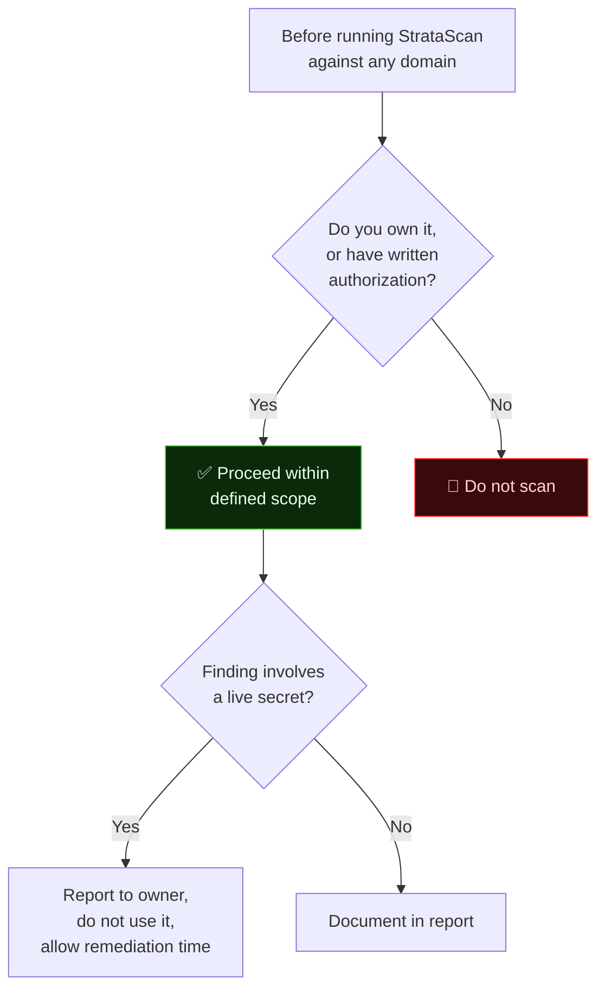

---

## 🆚 Comparison to Adjacent Tooling

| Tool Class | Example Tools | What StrataScan Adds |
|---|---|---|
| Subdomain enumerators | `subfinder`, `amass` | Archive-sourced historical subdomains spanning years, not just a point-in-time crawl |
| Secret scanners | `trufflehog`, `gitleaks` | Operates against the **public web archive**, not just git history — finds secrets that were never committed to a repo you control |
| Wayback utilities | `waybackurls`, `gau` | Full forensic layer on top — diffing, deletion analysis, takeover probing, severity scoring, not just a URL list |
| General recon frameworks | `recon-ng`, `theHarvester` | Temporal/archival focus as the organizing principle, not a bolt-on module |
| TLS/DNS auditors | `testssl.sh`, `dnsrecon` | Folded into the same evidence pipeline and correlated against historical state, not a standalone report |

StrataScan is not a replacement for any of the above — it is complementary, occupying the specific niche of **temporal/archival attack-surface reconstruction**, a dimension most recon tooling ignores entirely.

---

## 🗺 Roadmap

- [ ] Distributed scan coordination across multiple operator nodes
- [ ] Plugin API for custom capability modules
- [ ] Native integration with bug-bounty platform scope APIs
- [ ] Expanded passive-DNS source integrations
- [ ] Optional encrypted-at-rest evidence cache
- [ ] Web-based report viewer (read-only, local-first)
- [ ] Capability-level false-positive feedback loop

---

## 🤝 Contributing

Contributions are welcome, particularly new **capability modules** (the catalog is intentionally extensible), additional **passive data sources**, and **report format** enhancements.

1. Fork the repository
2. Add your capability to `CAPABILITY_CATALOG` and, if it introduces a new phase, to `PHASE_IDS` + `CAP_TO_PHASES`
3. Keep new active-probing capabilities **strictly read-only** — this is a hard project rule, not a style preference
4. Submit a PR describing the capability, its data source, and its severity-scoring rationale

---

## ❓ FAQ

**Does StrataScan exploit anything?**
No. It performs reconnaissance, historical data mining, and read-only verification only. There is no exploitation code in the project.

**Can I run this without touching the live target at all?**
Yes — disable every active phase (`phase` filtering) and StrataScan operates entirely against archive and passive-DNS sources.

**Will this get me rate-limited by the Wayback Machine?**
Adaptive jitter and conservative concurrency are enabled by default specifically to avoid this. You can tune the window with `jitter min`/`jitter max`.

**What happens to secrets StrataScan finds?**
They stay local — written to your SQLite cache and report files. Nothing is transmitted off your machine by the tool.

**Is this legal to use?**
Only against assets you own or are explicitly authorized to test. See [Legal & Ethical Use](#-legal--ethical-use).


---

## 🧪 Case Study Walkthrough (Illustrative, Fictional Target)

To make the pipeline concrete, here is a narrative walkthrough of a typical authorized engagement against a fictional target, `acme-example.test`.

### Step 1 — Passive-only pass

The operator disables every active phase and runs archive-only acquisition first:

```
target acme-example.test
phase p01,p06,p07,p08,p10,p13,p26
run
```

This alone reconstructs: every CDX-indexed snapshot, every certificate-transparency SAN ever issued for the domain, WHOIS/RDAP registration history, passive-DNS records from third-party aggregators, parsed `robots.txt`/`sitemap.xml` history, and historical disallow-rule diffs — all without a single packet reaching `acme-example.test` itself.

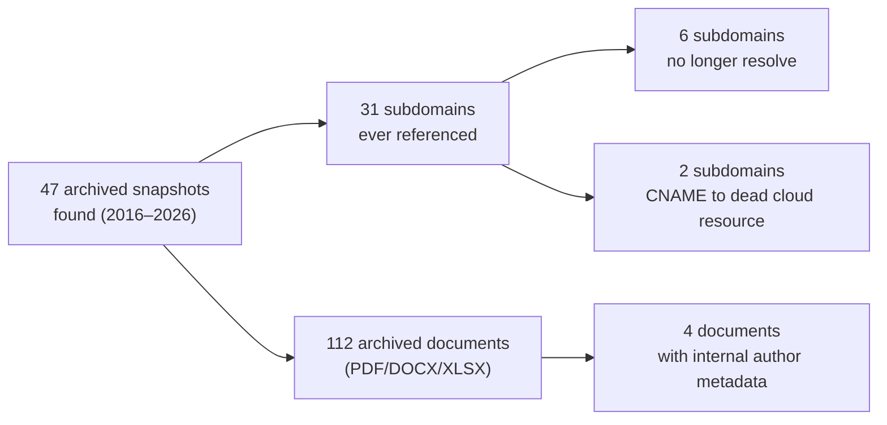

### Step 2 — Full pipeline with live verification

Once passive reconnaissance confirms the engagement is worth deepening (and scope is reconfirmed), the operator runs the full 47-phase pipeline:

```
phase all
raw on
run
```

This adds: live DNS/TLS verification of every discovered subdomain, HTTP header harvesting and security-header diffing, JS bundle and source-map harvesting with secret scanning, subdomain-takeover probing against the two dead-CNAME candidates identified in Step 1, and framework/CMS fingerprinting.

### Step 3 — Triage

The HTML report sorts findings by severity. In this illustrative run: one CRITICAL finding (a historical `.env` snapshot exposing a database credential, last archived three years prior but matching the live database's connection format), one HIGH finding (confirmed subdomain takeover against `old-promo.acme-example.test`, CNAME pointing at a deprovisioned static-site host), and a long tail of MEDIUM/LOW findings (exposed internal document metadata, verbose stack traces on a legacy error page, weak cipher support on one TLS endpoint).

### Step 4 — Disclosure

Findings are reported to the asset owner through the authorized channel (bug-bounty platform or direct client contact), with the raw evidence bundle attached for reproducibility. No credential is used; no takeover is claimed by actually registering the dangling resource without separate, explicit authorization to do so.

---

## 🌐 Supported Data Sources

| Source | Data Provided | Access Pattern | Default Throttling |
|---|---|---|---|
| Wayback Machine CDX/Timemap | Full snapshot index, timelines, calendar density | Passive, archive-only | Adaptive jitter (5–8s default window) |
| Common Crawl Index | Independent crawl history, cross-validation | Passive, archive-only | Token-bucket limited |
| archive.today | Independent snapshot mirror lookup | Passive, archive-only | Token-bucket limited |
| Certificate Transparency (crt.sh) | Historical SAN/subdomain issuance records | Passive, public log query | Token-bucket limited |
| RDAP / WHOIS (port 43) | Registration history, registrar, nameservers | Passive, public registry query | Token-bucket limited |
| Authoritative DNS | Live A/AAAA/CNAME/MX/NS/SOA/TXT/CAA/SRV/TLSA records | Active, read-only query | Token-bucket limited |
| Passive DNS (Robtex, Mnemonic, HackerTarget) | Historical DNS resolution records | Passive, public API query | Token-bucket limited, per-provider |
| Live target (HTTP/HTTPS/TCP/TLS) | Headers, status codes, TLS config, open ports | Active, read-only query | Token-bucket limited, opt-in jitter |

---

## 🧯 Extended Threat Model Notes

| Scenario | StrataScan's Posture |
|---|---|
| Target has a WAF in front of it | WAF fingerprinting is passive observation of response signatures; StrataScan does not attempt to bypass or evade a detected WAF |
| Target's DNS correctly refuses zone transfer | Expected and desired behavior; logged as "AXFR refused" with no further action attempted |
| A discovered secret is a live production credential | Reported with CRITICAL severity and full provenance; never used, tested, or validated against any live service by the tool |
| Subdomain takeover candidate identified | Reported as a candidate with supporting DNS evidence; StrataScan does not register, claim, or otherwise act on the dangling resource |
| Rate-limited by a third-party API mid-scan | Token bucket backs off automatically; phase is marked partially-complete rather than retried aggressively |
| Operator interrupts mid-scan | All findings persisted up to that point are flushed to a valid partial report; no data loss, no incomplete/corrupt output |

---

## 🙋 Extended FAQ

**Does StrataScan store anything outside my machine?**
No. All acquisition, caching, and reporting happen locally. The only outbound traffic is to the archive/DNS/TLS/HTTP sources being queried.

**Can StrataScan be used purely defensively, with no "offensive" framing at all?**
Yes — many organizations run it exclusively against their own domains as a recurring self-audit, using `baseline` diffing to track drift between runs. Nothing about the tool requires an adversarial framing.

**How does StrataScan avoid false-positiving on every minified JS file?**
The entropy gate plus context-aware pattern matching (distinguishing a 40-character hex string that's a git commit hash from one that's a secret, for example) keeps precision high; severity scoring further isolates genuinely actionable findings from background noise.

**Is subdomain brute-forcing "offensive"?**
DNS resolution of a candidate hostname is a standard, passive-from-the-target's-perspective public DNS query — functionally identical to a web browser's DNS lookup. It carries no exploitation risk; its only output is "does this name resolve, and to what."

**Can I extend the capability catalog myself?**
Yes — see [Contributing](#-contributing). The catalog is a flat, append-friendly list by design.

**Why 47 phases specifically?**
The phase count reflects the natural dependency graph of the underlying data: archive acquisition must precede content parsing, content parsing must precede secret/forensic analysis, and correlation/diffing must follow all of the above. 47 is simply how many distinct stages that graph currently decomposes into — the architecture does not treat the number as fixed, and new phases are added as new data sources or analysis techniques are integrated.
## 🧮 Severity Scoring Model

Every secret and sensitive finding is scored, not just matched. The model combines three independent signals:

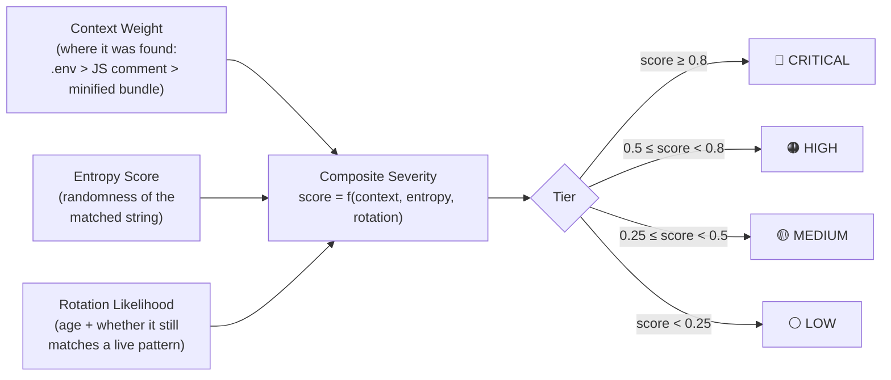

| Tier | Criteria (typical) | Example |
|---|---|---|
| 🔴 **CRITICAL** | High-entropy secret in a structural config file (`.env`, `wp-config.php`), recently seen, matches a live credential format | AWS secret access key in an archived `.env` |
| 🟠 **HIGH** | High-entropy secret in application code or a source map, context suggests production use | Database connection string embedded in a minified JS bundle |
| 🟡 **MEDIUM** | Plausible secret pattern but ambiguous context, or an older finding with likely rotation | JWT with an expired `exp` claim found in a years-old snapshot |
| ⚪ **LOW** | Low-entropy or templated match, likely placeholder/example | `API_KEY=your_key_here` in a README-style file |

Severity never overrides the raw finding — all tiers are retained in the evidence bundle. Severity only informs **sort order and triage priority** in generated reports.

---

## 📄 Example Report Excerpt (Redacted)

A representative (fully redacted) excerpt from a JSON report, illustrating the record shape every format shares:

```json
{
  "target": "example.com",
  "scan_started": "2026-09-14T02:11:03Z",
  "scan_completed": "2026-09-14T02:44:51Z",
  "phases_run": 47,
  "findings": [
    {
      "capability": "secrets",
      "severity": "CRITICAL",
      "type": "aws_secret_key",
      "source_url": "https://web.archive.org/web/2019*/example.com/.env",
      "first_seen": "2019-03-02T00:00:00Z",
      "last_seen": "2019-03-02T00:00:00Z",
      "context": "AWS_SECRET_ACCESS_KEY=[REDACTED]",
      "entropy": 4.81,
      "rotation_likelihood": "unknown — recommend immediate rotation"
    },
    {
      "capability": "takeover",
      "severity": "HIGH",
      "subdomain": "old-app.example.com",
      "cname_target": "example-app.herokuapp.com",
      "status": "CNAME resolves, target application not found",
      "first_seen_archived": "2021-06-11T00:00:00Z"
    },
    {
      "capability": "deletion_window",
      "severity": "MEDIUM",
      "url": "https://example.com/internal/admin-login",
      "last_archived": "2020-01-14T00:00:00Z",
      "disappeared_between": ["2020-01-14", "2020-02-02"],
      "note": "removed from robots.txt disallow list same window"
    }
  ],
  "summary": {
    "critical": 1,
    "high": 4,
    "medium": 11,
    "low": 38,
    "subdomains_total": 212,
    "takeover_candidates": 1
  }
}
```

---

## ⚙️ Performance & Concurrency Model

StrataScan uses a bounded `concurrent.futures` thread pool for all network I/O, with per-host throttling layered on top so parallelism never translates into target-side burst traffic.

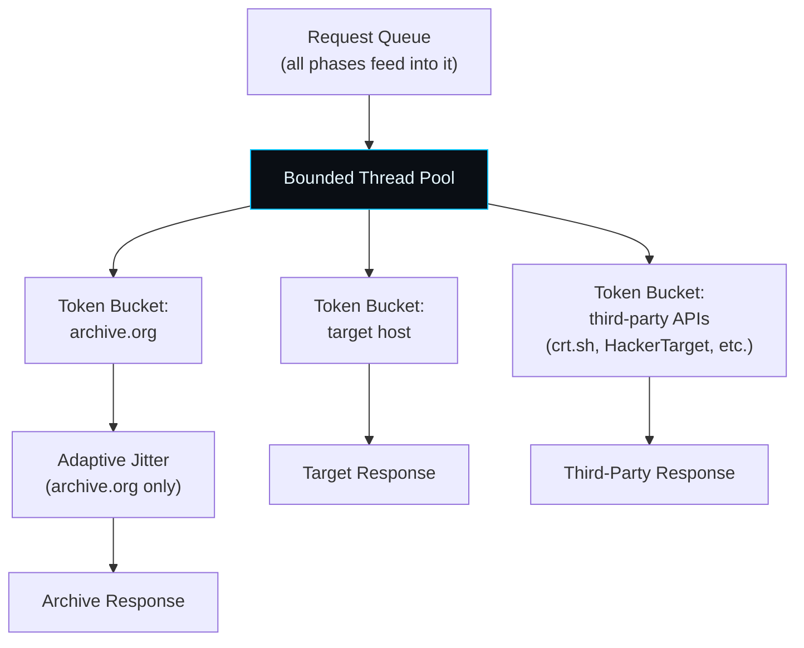

- **Thread pool, not process pool** — I/O-bound workload, so GIL contention is negligible relative to network latency.
- **Per-host token buckets** — archive.org, the live target, and each third-party API (crt.sh, HackerTarget, Robtex, Mnemonic) are throttled independently, so a slow or rate-limited source never blocks unrelated work.
- **SQLite as a write-ahead cache** — findings are persisted incrementally, which is what makes `Ctrl+C` mid-scan safe: a partial report always reflects real, already-verified findings rather than an all-or-nothing transaction.
- **Checkpointing** — long-running phases checkpoint progress so a resumed scan (same target, same cache directory) skips already-completed acquisition work.

---

## 🔄 Proxy & User-Agent Rotation

```mermaid
sequenceDiagram
    participant R as Request
    participant UA as UA Rotator
    participant PX as Proxy Pool
    participant T as Target/Source

    R->>UA: next request
    UA->>UA: pick from real-browser UA list\n(Chrome/Firefox/Edge, multiple versions/OSes)
    UA-->>R: UA header
    R->>PX: request proxy (if pool loaded)
    PX->>PX: round-robin / health-aware selection
    PX-->>R: proxy endpoint
    R->>T: outbound request (rotated UA + proxy)
    T-->>R: response
    alt proxy failed
        R->>PX: mark unhealthy, retry with next
    end
```

- Load a proxy list with `proxy load <file>` (compatible with common public proxy-list formats, e.g. `host:port` per line).
- UA rotation draws from a large, realistic pool of current and recent Chrome, Firefox, and Edge user-agent strings across Windows, macOS, and Linux variants — reducing trivial fingerprinting of the scan as automated traffic.
- Proxy rotation is **optional** and primarily intended for distributing request volume and reducing single-IP rate-limiting friction against third-party data sources — not for evading detection during an engagement where the client expects to see your traffic.

---

## 🗂 Configuration Reference

### `.stratascan_ignore`

Placed in the scan output directory, this file defines scope exclusions — hosts, path prefixes, or regex patterns that StrataScan will never query, regardless of what capabilities are enabled.

```
# .stratascan_ignore
# One pattern per line. Lines starting with # are comments.

# Exclude an entire subdomain
partner-portal.example.com

# Exclude a path prefix
/internal-only/

# Exclude via regex (prefix with re:)
re:^staging-\d+\.example\.com$
```

### Baseline files

Any previously generated JSON report can be passed to `baseline <file.json>` to diff the current scan against it — new subdomains, new/rotated secrets, and newly-dead URLs are all highlighted in the resulting report's diff section.

---

## ⚠️ Known Limitations

- **Archive coverage is not uniform.** Low-traffic or recently-created domains may have sparse Wayback/Common Crawl history, limiting the historical-analysis capabilities proportionally.
- **Secret detection is pattern-and-entropy based**, not semantic — it will occasionally surface high-entropy non-secrets (session IDs, build hashes) despite the entropy gate; triage via severity tier is still recommended.
- **Zone-transfer and wildcard checks depend on target misconfiguration** to produce results; a well-configured DNS server will correctly refuse these, which is the expected and desired outcome, not a tool failure.
- **JS deobfuscation is a "light walk,"** not a full AST-based deobfuscator — heavily obfuscated bundles may yield partial results.
- **Proxy health is only as good as the supplied list** — StrataScan does not validate proxy trustworthiness or anonymity level; operator-supplied proxy lists are used as-is.

---

## 📚 Glossary

| Term | Meaning |
|---|---|
| **CDX** | The Wayback Machine's index API, returning every captured snapshot record for a URL/domain |
| **Memento / TimeMap** | Standardized protocol (RFC 7089) for listing archived versions of a resource across multiple archives |
| **SURT** | Sort-friendly URI Reordering Transform — the canonical URL key form used for deduplication |
| **Entropy gate** | A filter that rejects low-randomness string matches to reduce false-positive secret detections |
| **Deletion window** | The time range bracketing when a URL was last seen archived and first confirmed gone |
| **Takeover candidate** | A subdomain whose DNS record still points at a de-provisioned third-party resource |
| **Provenance** | The first-seen/last-seen timestamps and source URL attached to every finding |
| **Phase** | One of 47 fixed pipeline stages; phases gate which capabilities execute and in what order |
| **Capability** | One of 198 individually selectable units of work within the engine |
| **Raw evidence bundle** | The `findings.jsonl` + `raw_snapshots/` + provenance export used for audit/chain-of-custody purposes |

## Appendix A: Full Capability Index (Alphabetical)

All 198 capabilities, alphabetically, for quick lookup by name or key.

| Capability | Key | Description |
|---|---|---|
| __NEXT_DATA__ parsing | `next_data` | Next.js SSR state |
| __NUXT__ parsing | `nuxt_data` | Nuxt SSR state |
| Adaptive jitter | `jitter` | Randomized 5-8s throttle for archive.org |
| Adjacent snapshot diffs | `adjacent_diff` | Diff every adjacent snapshot pair |
| Analytics event extraction | `analytics_events` | Track/send/log calls |
| Analytics ID extraction | `analytics` | GA, GA4, GTM, FB Pixel |
| Anchor text search | `anchor` | Which URLs referenced a term |
| API endpoint discovery | `api_endpoints` | Every /api/... string |
| Archive exclusion detection | `exclusions` | X-Robots-Tag noarchive/noindex |
| Archive.today lookup | `archive_today` | Independent snapshot lookup |
| Archived header diff | `archived_header_diff` | Historical Server/CSP/cookie changes |
| Archived header extraction | `archived_headers` | X-Archive-Orig-* headers per snapshot |
| ARIA label extraction | `aria` | aria-label, aria-description |
| ASN lookup | `asn` | Network ownership |
| atob/Buffer.from decoder | `atob` | Decode JS-embedded base64 |
| Availability API | `availability` | Nearest-snapshot lookup |
| Base64 auto-decode | `b64` | Decode + rescan base64 |
| Base64 data URI decoding | `data_uri` | Decode base64 data URIs |
| Basic auth URL extraction | `basic_auth_url` | user:pass@host |
| BIMI records | `bimi` | Brand Indicators for Message Identification |
| Calendar captures API | `calendar` | Per-day snapshot density |
| Capture gap detection | `gaps` | Periods with no snapshots |
| Capture timeline | `timeline_monthly` | Snapshots by month |
| Case variant enumeration | `case_variant` | /About vs /about vs /ABOUT |
| Catch-all email detection | `catchall` | Wildcard mail behavior |
| CDX filter language | `cdx_filter` | statuscode/mimetype/regex filters |
| CDX full-field query | `cdx_full` | urlkey, offset, filename, redirect fields |
| CDX index fetch | `cdx` | Pull every snapshot record for the target domain |
| CDX prefix query | `cdx_prefix` | matchType=prefix path enumeration |
| CDX timeline per URL | `timeline` | Full status history per URL |
| Certificate chain validation | `tls_chain` | Broken/incomplete chains |
| Certificate Transparency (crt.sh) | `crt` | Subdomain lookup |
| CLI mode | `cli` | Scriptable batch scan |
| Cloud metadata leak | `cloud_meta` | 169.254.169.254 references |
| CMS fingerprinting | `cms` | CMS signatures |
| Common Crawl query | `common_crawl` | Independent crawl history |
| Console log extraction | `console_logs` | console.log strings |
| Content-type breakdown | `content_types` | Mimetype frequency |
| Cookie flag analysis | `cookie_flags` | Secure, HttpOnly, SameSite |
| Cookie JWT detection | `cookie_jwt` | Session cookies carrying JWTs |
| CORS misconfiguration | `cors` | Access-Control-Allow-Origin: * |
| Credential provenance | `cred_provenance` | First/last seen, context, rotation |
| Credential severity scoring | `cred_score` | severity x context x rotation |
| Cross-scan baseline diff | `baseline_diff` | Compare current vs previous report |
| CSP parsing | `csp_parse` | Directive-by-directive |
| CSS comment extraction | `css_comments` | Every CSS comment |
| CSS file discovery | `css_files` | Every stylesheet |
| CSV report | `report_csv` | One row per URL |
| Data attribute extraction | `data_attrs` | data-* attributes |
| Deletion classification | `deletion_class` | removed/gone/legal/blocked/redirected/offline |
| Deletion window detection | `deletion_window` | Bracket when each URL disappeared |
| Digest change rate | `churn` | Content churn ratio |
| Digest clustering | `digest_cluster` | Duplicate content graph |
| Disallow cross-reference | `disallow_xref` | robots.txt paths that were archived |
| Django settings parser | `django_parser` | PASSWORD fields |
| DKIM selector enumeration | `dkim` | Reveals mail provider |
| DNS full record lookup | `dns_full` | A/AAAA/CNAME/MX/NS/SOA/TXT/CAA |
| DNS resolution | `dns` | Live IPv4 + IPv6 |
| DNS SMIMEA lookup | `smimea` | S/MIME cert fingerprints |
| DNS SRV enumeration | `srv` | Service location records |
| DNS TLSA lookup | `tlsa` | DANE cert fingerprints |
| DNSSEC validation | `dnssec` | Signing status |
| Docker env block parser | `docker_parser` | docker-compose environment |
| Document harvesting | `documents` | Every archived document |
| Duplicate site detection | `duplicate_site` | Digest clusters |
| Email extraction | `emails` | Every email found |
| Email MX validation | `email_mx` | Mail server check |
| Email permutation generation | `email_perm` | Corporate email guesses |
| Entropy gate | `entropy` | Filter low-entropy secret matches |
| Environment name extraction | `env_names` | production/staging/dev |
| External domain graph | `external_domain_graph` | External hosts seen |
| Feed link discovery | `feeds` | RSS/Atom feeds |
| File extension frequency | `file_extensions` | File extensions across URLs |
| First vs last diff | `first_last_diff` | Diff earliest and latest snapshot body |
| First/last seen | `first_last_seen` | Earliest and latest snapshot |
| Form + input extraction | `forms` | Every form + input |
| Form endpoint history | `form_endpoint_history` | Forms aggregated per action |
| Framework endpoint enumeration | `framework_endpoints` | framework-specific paths |
| Google/Bing dork generation | `dorks` | Search engine dorks |
| GraphQL endpoint discovery | `graphql_endpoints` | /graphql, /gql, /query |
| GraphQL query extraction | `gql_queries` | query/mutation strings |
| HackerTarget API | `hackertarget` | Reverse IP, DNS lookup |
| Header secret extraction | `header_secrets` | X-Api-Key, Authorization echoes |
| Header summary | `header_summary` | Aggregate servers, security, CDN, cookies |
| Hex auto-decode | `hex` | Decode + rescan hex |
| Hidden element extraction | `hidden` | display:none, aria-hidden, hidden inputs |
| Hreflang extraction | `hreflang` | i18n alternates |
| HSTS preload check | `hsts_preload` | Preload list membership |
| HTML comment extraction | `comments` | Every comment with context |
| HTML report | `report_html` | Dark-themed with severity |
| HTTP/2 detection | `http2` | Protocol version |
| ICS calendar parsing | `ics` | Events, attendees |
| Iframe discovery | `iframes` | Every iframe src |
| Ignore allowlist | `ignore_file` | .stratascan_ignore file |
| Image alt text extraction | `alt_text` | alt= attributes |
| Image discovery | `images` | Every img src |
| Image EXIF extraction | `exif` | GPS, camera, software |
| Internal/external links | `links` | Link graph per page |
| JS bundle harvesting | `js_bundles` | Fetch every .js and scan |
| JS comment extraction | `js_comments` | Every JS comment |
| JS deobfuscation | `js_deobfuscate` | Basic walk on minified JS |
| JS error message extraction | `js_errors` | throw new Error strings |
| JS file discovery | `js_files` | Every script src |
| JSON report | `report_json` | Machine-readable dump |
| JSON tree walker | `json_walker` | Recursive JSON secret extraction |
| JSON-LD extraction | `jsonld` | Structured data blocks |
| JSONL checkpoint | `jsonl` | Append-only record log per scan |
| JWT claim extractor | `jwt_claims` | iss/aud/sub/role/exp |
| Link rot quantification | `link_rot` | Ratio of dead outbound links |
| Live header harvest | `headers` | Full HTTP response headers |
| Live status probing | `live_status` | HEAD every archived URL |
| Log file parsing | `log_parse` | Usernames, IPs, paths |
| Manifest discovery | `manifest` | PWA manifest |
| Mass deletion clustering | `mass_deletion` | Group URLs deleted in same window |
| Memento aggregator | `memento_agg` | Multi-archive TimeMap |
| Memento TimeMap (JSON) | `timemap_json` | JSON-format TimeMap |
| Memento TimeMap (link) | `timemap` | Machine-readable snapshot list |
| Mnemonic Passive DNS | `mnemonic_pdns` | Free passive DNS |
| Nonce/CSRF extraction | `nonce` | Nonces and CSRF tokens |
| OCSP/CRL check | `ocsp` | Revocation support |
| Office macro detection | `office_macros` | VBA macro presence |
| Office metadata extraction | `office_meta` | Author, company |
| Page intelligence | `page_intel` | Title, generator, canonical, meta, headings |
| PDF metadata extraction | `pdf_meta` | Author, XMP, producer |
| PEM/CRT/KEY parsing | `pem_parse` | Cert/key material |
| PGP key parsing | `pgp` | UID, email, fingerprint |
| Phone extraction | `phones` | Context-anchored phones |
| phpinfo parser | `phpinfo_parse` | Table-structured phpinfo output |
| Pingback/webmention links | `pingback` | Pingback, webmention endpoints |
| Placeholder text extraction | `placeholder` | placeholder= attributes |
| PNG chunk extraction | `png_chunks` | Text chunks |
| Port variant enumeration | `port_variant` | :80 vs :8080 |
| Preconnect/prefetch domains | `preconnect` | Third-party domains |
| Proxy rotation | `proxy` | Rotate outbound requests through proxies |
| Query param evolution | `query_param_evolution` | Query params over time per path |
| Query parameter frequency | `query_params` | Query params across URLs |
| Rate limit header parsing | `ratelimit` | API quota hints |
| Rate limiting | `rate_limit` | Token bucket per host |
| RDAP WHOIS | `rdap` | Modern JSON WHOIS |
| Redirect history | `redirects` | 301/302/303/307/308 events |
| Resurrection map | `resurrection` | Removed URL -> last live snapshot |
| Reverse DNS lookup | `ptr` | PTR from IP |
| Revisit detection | `revisit` | warc/revisit records |
| robots.txt historical diff | `robots_diff` | New disallow rules over time |
| robots.txt parsing | `robots_parsed` | User-agents, disallow, allow, sitemaps |
| Robtex passive DNS | `robtex` | Free passive DNS history |
| RSS/Atom feed parsing | `rss` | Content feed extraction |
| Scheme variant enumeration | `scheme_variant` | http vs https |
| Secret age estimation | `secret_age` | First/last seen per secret |
| Secret scanning | `secrets` | secret patterns |
| sitemap.xml historical diff | `sitemap_diff` | New/removed URLs over time |
| sitemap.xml parsing | `sitemap_parsed` | URLs, nested sitemaps, lastmods |
| Slash variant enumeration | `slash_variant` | /page vs /page/ |
| Snapshot count ranking | `snapshot_rank` | Importance proxy |
| Snapshot sparkline | `sparkline` | Per-year snapshot density |
| Social link extraction | `social_links` | Every social profile |
| Source map fetching | `source_maps` | Fetch .js.map and scan |
| Source map sourcesContent | `source_content` | Extract per-file source |
| Source-map reference extraction | `sourcemaps` | sourceMappingURL refs |
| Special file content scan | `special_scan` | Fetch + scan every hit for secrets |
| Special file probing | `special_files` | well-known sensitive paths |
| SQL dump parsing | `sql_dump` | Tables, columns, sample rows |
| SRI hash extraction | `sri` | Subresource Integrity |
| SSH key fingerprinting | `ssh_key` | SHA-256 fingerprint |
| Stack trace parser | `stack_trace` | Error pages leaking config |
| Status code breakdown | `status_codes` | HTTP status frequency |
| Structural env parser | `env_parser` | .env KEY=VALUE extraction |
| Subdomain brute-force | `subdomain_brute` | Wordlist-based DNS enumeration |
| Subdomain cross-reference | `subdomain_crossref` | First/last seen per subdomain |
| Subdomain enumeration | `subdomains` | Every subdomain in CDX |
| Subdomain first/last seen | `subdomain_stats` | Timeline stats per subdomain |
| Subdomain permutation | `subdomain_perm` | dev-, staging-, api- patterns |
| Subdomain takeover probe | `takeover` | Dead subdomains claimable |
| SVG embedded JS detection | `svg_js` | XSS vectors |
| TAR internal listing | `tar_listing` | Contained files |
| TCP port scan | `ports` | Open ports on resolved IPs |
| Title attribute extraction | `title_attr` | title= tooltips |
| TLS certificate info | `tls` | Subject, issuer, SANs, validity |
| TLS cipher enumeration | `tls_ciphers` | Weak/strong cipher support |
| TLS version enumeration | `tls_versions` | TLS 1.0/1.1/1.2/1.3 support |
| Torrent file parsing | `torrent` | Trackers, file list |
| TUI mode | `tui` | Interactive console |
| TXT report | `report_txt` | Full detailed text report |
| URL depth distribution | `url_depths` | Path segments per URL |
| URL param credential scan | `url_param_creds` | token=, key=, password=, pwd= |
| URLKey analysis | `urlkey` | SURT-form dedup |
| User-agent rotation | `ua` | real UAs |
| Version number extraction | `versions` | Semantic versions |
| WAF fingerprinting | `waf` | Cloudflare, Akamai, Sucuri |
| Wayback vs live diff | `wayback_live_diff` | Compare last archive with live |
| WebSocket URL extraction | `ws_urls` | wss:// endpoints |
| WHOIS via port 43 | `whois` | Legacy WHOIS with referral |
| Wildcard DNS detection | `wildcard` | Random subdomain probe |
| window.__INITIAL_STATE__ parsing | `initial_state` | App state from JS |
| WP config parser | `wp_parser` | wp-config.php constants |
| X-Archive-Src extraction | `archive_src` | WARC collection identifier |
| ZIP internal listing | `zip_listing` | Contained files |
| Zone transfer attempt | `axfr` | AXFR test |

---

## Appendix B: Phase Dependency Graph

Selecting any single capability automatically pulls in the phase(s) it belongs to, and — via this table — any phase(s) that phase itself depends on. `FETCHING CDX INDEX` (p01) is the root dependency for the large majority of the pipeline, which is why it cannot be excluded independently of disabling most of the engine.

| Phase | Depends On |
|---|---|
| FETCHING CDX INDEX | *(root — no dependency)* |
| TLS / DNS RECON | *(root — no dependency)* |
| WAYBACK / ARCHIVE ENDPOINTS | *(root — no dependency)* |
| CERTIFICATE TRANSPARENCY | *(root — no dependency)* |
| WHOIS / RDAP | *(root — no dependency)* |
| DNS FULL RECORDS | *(root — no dependency)* |
| PASSIVE DNS SOURCES | *(root — no dependency)* |
| SPECIAL FILES | *(root — no dependency)* |
| PARSING ROBOTS / SITEMAP | *(root — no dependency)* |
| FRAMEWORK ENDPOINTS | *(root — no dependency)* |
| CLOUD BUCKET ENUMERATION | *(root — no dependency)* |
| DORK GENERATION | *(root — no dependency)* |
| ROBOTS/SITEMAP HISTORICAL DIFF | *(root — no dependency)* |
| SUBDOMAIN PERMUTATION + BRUTE | *(root — no dependency)* |
| RAW EVIDENCE EXPORT | *(root — no dependency)* |
| COVERAGE REPORT | *(root — no dependency)* |
| CACHE WARMUP | *(root — no dependency)* |
| HARVESTING HTTP HEADERS | FETCHING CDX INDEX |
| DELETION FORENSICS | FETCHING CDX INDEX |
| WAYBACK VS LIVE DIFF | FETCHING CDX INDEX |
| MAPPING TOPOLOGY | FETCHING CDX INDEX |
| SCANNING SPECIAL FILE CONTENTS | SPECIAL FILES |
| CONTENT INTEL | FETCHING CDX INDEX |
| JS BUNDLE HARVESTING | FETCHING CDX INDEX |
| SOURCE MAP HARVESTING | CONTENT INTEL |
| JS DEOBFUSCATION | FETCHING CDX INDEX |
| SUBDOMAIN TAKEOVER PROBE | MAPPING TOPOLOGY |
| ADJACENT SNAPSHOT DIFFS | FETCHING CDX INDEX |
| ARCHIVED HEADERS | FETCHING CDX INDEX |
| DOCUMENT METADATA | MAPPING TOPOLOGY |
| EMAIL PERMUTATIONS + MX | CONTENT INTEL |
| VARIANT ENUMERATION | FETCHING CDX INDEX |
| RESURRECTION MAP | DELETION FORENSICS |
| LINK ROT QUANTIFICATION | CONTENT INTEL |
| QUERY PARAM EVOLUTION | FETCHING CDX INDEX |
| SECRET AGE ESTIMATION | CONTENT INTEL |
| FORM ENDPOINT HISTORY | CONTENT INTEL |
| EXTERNAL DOMAIN GRAPH | CONTENT INTEL |
| DUPLICATE SITE DETECTION | FETCHING CDX INDEX |
| REVISIT RECORD ANALYSIS | FETCHING CDX INDEX |
| URLKEY / SURT ANALYTICS | FETCHING CDX INDEX |
| SNAPSHOT DENSITY RANKING | FETCHING CDX INDEX |
| REDIRECT CHAIN RECONSTRUCTION | FETCHING CDX INDEX |
| PASSIVE CRAWL CORRELATION | WAYBACK / ARCHIVE ENDPOINTS |
| PAGE TREE RECONSTRUCTION | FETCHING CDX INDEX |
| DUPLICATE SECRET COLLAPSE | CONTENT INTEL |
| CREDENTIAL CORRELATION | CONTENT INTEL |
| PROBING LIVE STATUS | FETCHING CDX INDEX |

### Dependency graph (core chain)

```mermaid
flowchart TD
    CDX["p01 FETCHING CDX INDEX\n(root dependency)"]
    CDX --> HEADERS[p04 HARVESTING HEADERS]
    CDX --> DEL[p18 DELETION FORENSICS]
    CDX --> TOPO[p03 MAPPING TOPOLOGY]
    CDX --> CI[p14 CONTENT INTEL]
    CI --> SM[p16 SOURCE MAP HARVESTING]
    TOPO --> TAKE[p19 TAKEOVER PROBE]
    TOPO --> DOC[p23 DOCUMENT METADATA]
    DEL --> RES[p30 RESURRECTION MAP]
    CI --> CRED[p44 CREDENTIAL CORRELATION]
    CI --> EMAIL[p29 EMAIL PERMUTATIONS]
```
## License

Released under the **MIT License**. See `LICENSE` for the full text.

```
MIT License — use, modify, and distribute freely, with attribution,
and without warranty of any kind.
```

<br/>

---

<div align="center">

```
░░░░░░░░░░░░░░░░░░░░░░░░░░░░░░░░░░░░░░░░░░░░░░░░░░░░░░░░░░░░░░░░░░░░░░
   S T R A T A S C A N   //   THE PAST IS YOUR ATTACK SURFACE TOO
░░░░░░░░░░░░░░░░░░░░░░░░░░░░░░░░░░░░░░░░░░░░░░░░░░░░░░░░░░░░░░░░░░░░░░
```

**[⬆ Back to top](#)**

Built for authorized researchers, red teamers, and defenders who believe
history doesn't get a pass just because it's old.

`// END OF TRANSMISSION //`

</div>
